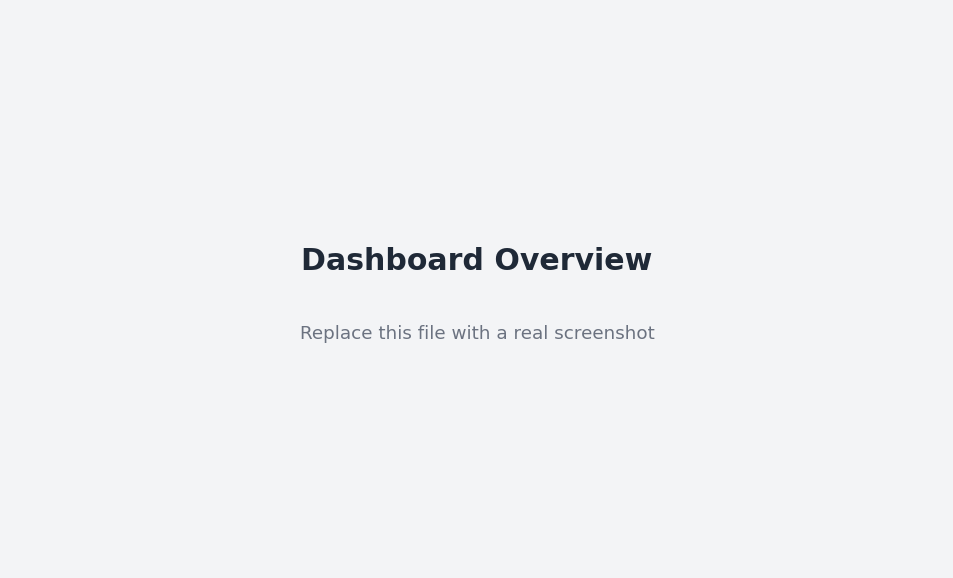
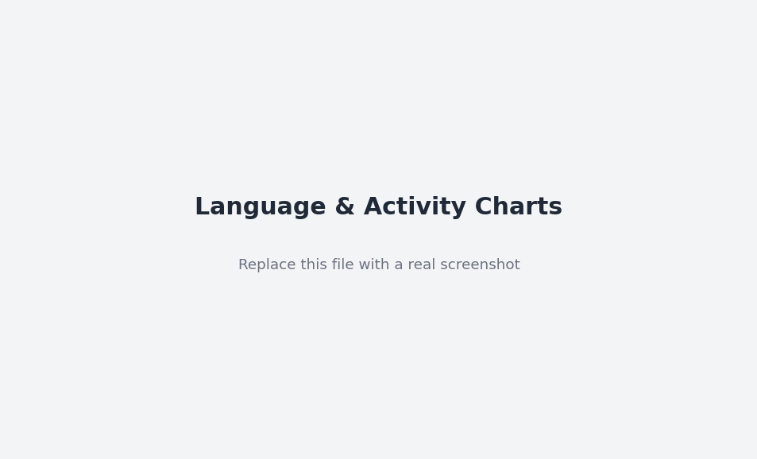
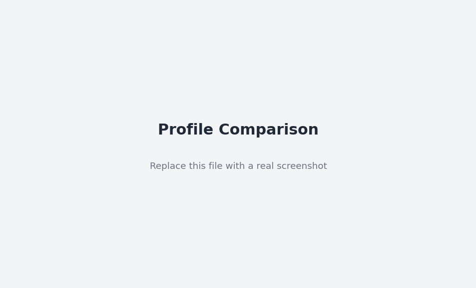
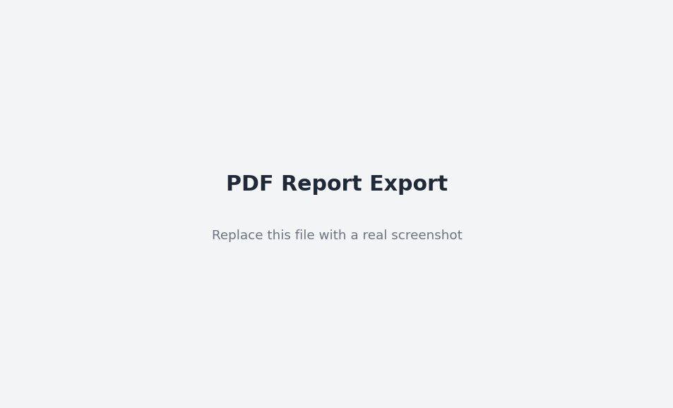

# 📊 GitHub Profile Analyzer

A production-ready, modular Python application for analyzing public GitHub developer profiles. It fetches repository data through the GitHub REST API, computes statistics with **Pandas/NumPy**, visualizes results with **Matplotlib**, calculates a composite **developer score**, exports a polished **PDF report**, stores analysis history in **SQLite**, and ships as an interactive **Streamlit** dashboard — fully containerized with **Docker**.

### 🌐 Live Demo

👉 **[https://hadidadashzadeh-gpa.streamlit.app](https://hadidadashzadeh-gpa.streamlit.app)**

The app also has a **"Try Demo"** button in the sidebar that instantly runs a full analysis on the developer's own GitHub profile — no typing required.

---

## 🖼️ Screenshots

| Dashboard | Charts |
|---|---|
|  |  |

| Profile Comparison | PDF Report |
|---|---|
|  |  |

> *(Placeholder images — replace the files in `/screenshots` with real screenshots from the live demo.)*

---

## ✨ Features

| Category | Details |
|---|---|
| **Profile Fetching** | Fetches user metadata and all public repositories via the GitHub REST API, with pagination and rate-limit handling |
| **Analysis** | Repository count, language distribution, stars, forks, watchers, estimated commit volume, activity level |
| **Charts** | Language distribution (pie), top repository statistics (bar), activity recency (bar) — all generated with Matplotlib |
| **Developer Score** | A weighted, log-dampened 0–100 composite score with a letter-grade label (Beginner → Elite) |
| **PDF Reports** | One-click, professionally formatted PDF export with embedded charts and tables (ReportLab) |
| **History Tracking** | Every analysis run is persisted to SQLite, enabling repository-growth trend charts over time |
| **Profile Comparison** | Head-to-head comparison of two GitHub users across every key metric |
| **Dashboard** | Streamlit UI showing total repos, most-used language, average stars, and growth trends |

---

## 🏗️ Architecture

The codebase follows a strict **separation of concerns**, with each class owning a single responsibility (SRP):

```
github_profile_analyzer/
├── app/
│   ├── config.py          # Centralized settings + logging setup
│   ├── exceptions.py      # Typed exception hierarchy
│   ├── models.py           # Dataclasses: Repository, GitHubUser, AnalysisResult
│   ├── github_client.py    # GitHubClient — all HTTP/API communication
│   ├── analyzer.py         # ProfileAnalyzer — orchestrates fetch + analysis (pandas/numpy)
│   ├── scoring.py          # DeveloperScoreCalculator — the scoring algorithm
│   ├── charts.py           # ChartGenerator — matplotlib visualizations
│   ├── database.py         # DatabaseManager — SQLite persistence layer
│   ├── comparator.py       # ProfileComparator — two-profile comparison logic
│   └── pdf_report.py       # PDFReportGenerator — ReportLab PDF export
├── streamlit_app.py         # Streamlit UI (dashboard, comparison, history pages)
├── tests/                   # Pytest unit tests for every core module
├── Dockerfile
├── docker-compose.yml
├── requirements.txt
└── README.md
```

**Design principles applied:**
- **OOP everywhere** — each responsibility is a class with a clear public interface.
- **Type hints** on every function signature and dataclass field.
- **Dependency injection** — `ProfileAnalyzer` accepts an optional `GitHubClient`, making it fully unit-testable with mocks (no real network calls in tests).
- **Custom exception hierarchy** (`app/exceptions.py`) instead of bare `except Exception`, so callers can react precisely (e.g. distinguish a 404 from a rate-limit error).
- **Structured logging** to both console and rotating log file.

---

## 🚀 Getting Started

### Option A — Run locally with Python

```bash
# 1. Clone and enter the project
git clone <your-repo-url>
cd github_profile_analyzer

# 2. Create a virtual environment
python -m venv .venv
source .venv/bin/activate        # Windows: .venv\Scripts\activate

# 3. Install dependencies
pip install -r requirements.txt

# 4. (Optional) Add a GitHub token to raise the API rate limit
cp .env.example .env
# then edit .env and paste your token

# 5. Run the app
streamlit run streamlit_app.py
```

The dashboard will open at **http://localhost:8501**.

### Option B — Run with Docker

```bash
docker compose up --build
```

Then open **http://localhost:8501**. Data, reports, charts, and logs are persisted to the host via bind-mounted volumes (`./data`, `./reports`, `./charts_output`, `./logs`).

To pass a GitHub token to the container:

```bash
GITHUB_TOKEN=ghp_xxxxxxxx docker compose up --build
```

---

## 🔑 GitHub API Rate Limits

- **Unauthenticated:** 60 requests/hour — fine for occasional single-profile lookups.
- **Authenticated (with a personal access token):** 5,000 requests/hour.

Generate a token at `https://github.com/settings/tokens` — no scopes are required for reading public data. Set it via `GITHUB_TOKEN` in your `.env` file or environment.

---

## 🧮 How the Developer Score Works

`DeveloperScoreCalculator` computes a 0–100 score from six weighted components:

| Component | Weight | Notes |
|---|---|---|
| Repository count | 15 | Log-scaled, capped at 100 repos |
| Total stars | 25 | Log-scaled, capped at 5,000 stars |
| Total forks | 15 | Log-scaled, capped at 1,000 forks |
| Followers | 15 | Log-scaled, capped at 2,000 followers |
| Estimated commits | 20 | Log-scaled, capped at 5,000 commits |
| Activity level | 10 | Very High / High / Medium / Low / No Activity |
| Language diversity | +5 bonus | 0.5 points per distinct language, capped at 10 languages |

Logarithmic scaling ensures a single outlier metric (e.g. one viral repo) cannot dominate the score, rewarding **consistent, well-rounded** contribution instead.

**Grade labels:** Elite (85+) · Advanced (70+) · Intermediate (50+) · Emerging (25+) · Beginner (<25)

---

## 🧪 Running Tests

```bash
pip install -r requirements.txt
pytest tests/ -v --cov=app --cov-report=term-missing
```

All external HTTP calls are mocked with `unittest.mock`, so the test suite runs fully offline and deterministically. Coverage includes:
- `GitHubClient` — success, 404, rate-limit, and generic error paths
- `ProfileAnalyzer` — aggregation correctness, empty-repo edge cases, input validation
- `DeveloperScoreCalculator` — boundary values, monotonicity, grade labels
- `DatabaseManager` — save/retrieve, filtering, growth series, deletion

---

## 📦 Tech Stack

| Layer | Technology |
|---|---|
| Language | Python 3.11+ |
| API Client | `requests` against the GitHub REST API v3 |
| Data Processing | Pandas, NumPy |
| Visualization | Matplotlib |
| PDF Generation | ReportLab |
| Persistence | SQLite (stdlib `sqlite3`) |
| UI | Streamlit |
| Testing | Pytest, pytest-mock, pytest-cov |
| Containerization | Docker, Docker Compose |

---

## 📌 Notes & Limitations

- **Commit estimation** samples the most recently updated repositories (rather than crawling full commit history) to stay within GitHub API rate limits, then scales the sample proportionally. This is an *estimate*, not an exact count — it's labelled as such throughout the UI and report.
- The GitHub REST API does not expose a single "total commits by user" endpoint; per-repository commit counts are inferred from pagination headers (`Link: rel="last"`), which is the standard lightweight technique for this.
- Private repositories are never accessed — only data visible through the public API is used.

---

## 📄 License

MIT — feel free to use this project as a portfolio piece or starting point for your own tools.
